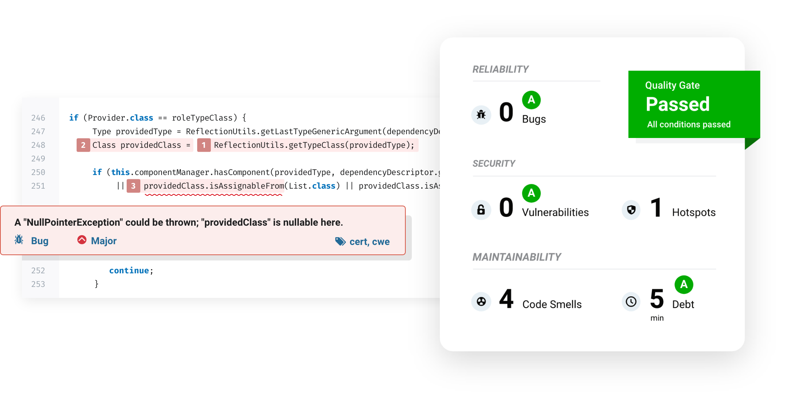

# Sonarqube on Fargate with CDK

[](https://sonarcloud.io/summary/new_code?id=engel80_sonarqube-fargate-cdk) [](https://sonarcloud.io/summary/new_code?id=engel80_sonarqube-fargate-cdk)
## Introduction

During App Modernization journey, a code visualization system is required for code quality management because many changes are needed.
[SonarQube](https://www.sonarqube.org/), the most famous and used solution, is an open-source platform developed by SonarSource for continuous inspection of code quality.
This project provides a solution including IaC code and configurations to run SonarQube on a container with minimum cost.




## Architecture


## Objectives

1. Build a continuous inspection of code quality on Fargate with SonarQube and CDK in 10 minutes
2. Running SonarQube with minimum cost using Fargate Spot and Aurora Serverless.
3. Help developers keep high-quality code using SonarQube

I hope you build and learn about code inspection/visualization systems using SonarQube in *1 day* only.

## Table of Contents

1. Deploy VPC stack
2. Deploy ECS Fargate cluster stack
3. Deploy IAM Role stack
4. Deploy ECR and CodeCommit repository stack
5. Deploy ECS Fargate Service stack
6. Create a Sonarqube Token
7. Run SonarQube Scanner

## Example

SonarQube version: *8.9.9-community*


## Prerequisites

```bash
npm install -g aws-cdk@2.32.1
npm install -g cdk-ecr-deployment@2.5.5

# install packages in the root folder
npm install
cdk bootstrap
```

Use the `cdk` command-line toolkit to interact with your project:

* `cdk deploy`: deploys your app into an AWS account
* `cdk synth`: synthesizes an AWS CloudFormation template for your app
* `cdk diff`: compares your app with the deployed stack
* `cdk watch`: deployment every time a file change is detected

## CDK Stack

|   | Stack                          | Time To Complete |
|---|--------------------------------|------|
| 1 | VPC                            | 3m 30s (optional)     |
| 2 | ECS Fargate cluster            | 50s  |
| 3 | IAM roles                      | 1m   |
| 4 | ECR and CodeCommit repository  | 1m   |
| 5 | ECS Fargate Service and ALB    | 4m   |
|   | Total                          | 7m (10m 30s with a new VPC) |

## Steps

Use the [deploy-all.sh](./deploy-all.sh) file if you want to deploy all stacks without prompt at a time.

### Step 1: VPC

Deploy a new VPC:

```bash
cd vpc
cdk deploy
```

[vpc/lib/vpc-stack.ts](./vpc/lib/vpc-stack.ts)

The VPC ID will be saved into the SSM Parameter Store(`/sonarqube-fargate-cdk/vpc-id`) to refer from other stacks.

To use the existing VPC, use the `-c vpcId` context parameter or create SSM Parameter:

```bash
aws ssm put-parameter --name "/sonarqube-fargate-cdk/vpc-id" --value "{existing-vpc-id}" --type String 
```

### Step 2: ECS cluster

```bash
cd ../ecs-sonarqube-cluster
cdk deploy 

# or define your VPC id with context parameter
cdk deploy -c vpcId=<vpc-id>
```

SSM parameter:

* /sonarqube-fargate-cdk/vpc-id

Cluster Name: [config.ts](./config.ts)

[ecs-sonarqube-cluster/lib/sonarqube-cluster-stack.ts](./ecs-sonarqube-cluster/lib/sonarqube-cluster-stack.ts)

### Step 3: IAM Role

Create the ECS Task Execution role and default Task Role.

* AmazonECSFargateTaskExecutionRole
* ECSFargateDefaultTaskRole including a policy for ECS Exec

```bash
cd ../ecs-iam-role
cdk deploy 
```

[ecs-iam-role/lib/ecs-iam-role-stack.ts](./ecs-iam-role/lib/ecs-iam-role-stack.ts)

### Step 4: ECR and CodeCommit repository

```bash
cd ../ecr-codecommit
cdk deploy --outputs-file ./cdk-outputs.json
cat ./cdk-outputs.json | jq .
```

### Step 5: ECS Service

Crearte a Fargate Service, Auto Scaling, ALB, and Log Group.

```bash
cd ../ecs-sonarqube-service
cdk deploy --outputs-file ./cdk-outputs.json
cat ./cdk-outputs.json | jq .
```

e.g.,

```json
{
  "ecs-sonarqube-fargate-dev": {
    "TaskDefinition": "sonarqube-task",
    "LogGroup": "sonarqube",
    "ALB": "alb-sonarqube-123456789.ap-northeast-2.elb.amazonaws.com",
    "Service": "arn:aws:ecs:ap-northeast-2:123456789:service/sonarqube-fargate-dev/sonarqube"
  }
}
```

SSM parameters:

* /sonarqube-fargate-cdk/vpc-id
* /sonarqube-fargate-cdk/cluster-securitygroup-id
* /sonarqube-fargate-cdk/task-execution-role-arn
* /sonarqube-fargate-cdk/default-task-role-arn

[ecs-sonarqube-service/lib/ecs-sonarqube-service-stack.ts](./ecs-sonarqube-service/lib/ecs-sonarqube-service-stack.ts)

**IMPORTANT**

If the ECS cluster was re-created, you HAVE to deploy after cdk.context.json files deletion with the below:

`find . -name "cdk.context.json" -exec rm -f {} \;`

### Step 6: Create a SonarQube Token

To connect to Sonarqube URL, refer to the `ecs-sonarqube-service/cdk-outputs.json` file.

1. Sign in with admin/admin and change the password.
2. Create a Token on Administration > Security > Users menu.


### Step 7: Run SonarQube Scanner

Run SonarQube Scanner using gradle wrapper:

```bash
./gradlew sonar -Dsonar.login="{your-sonarqube-token}" -Dsonar.host.url="{alb-endpoint}"

# e.g.,
# gradle sonar -Dsonar.login="bd853394582391ee93c5efff61c2b53e356b1eb7d" -Dsonar.host.url="http://alb-sonarqube-123456789012.ap-northeast-2.elb.amazonaws.com"
```


If you want to integrate with Jenkins using Webhooks, refer to the https://github.com/engel80/sonarqube-jenkins repository.

## Clean Up

[clean-up.sh](./clean-up.sh)

## Structure

```text
├── build.gradle
├── deploy-all.sh
├── clean-up.sh
├── config.ts
├── package.json
├── tsconfig.json
├── app
│   ├── Dockerfile
│   └── build.sh
├── ecr-codecommit
│   ├── bin
│   │   └── index.ts
│   ├── cdk.json
│   └── lib
│       └── ecr-codecommit-stack.ts
├── ecs-iam-role
│   ├── bin
│   │   └── index.ts
│   ├── cdk.json
│   └── lib
│       └── ecs-iam-role-stack.ts
├── ecs-sonarqube-cluster
│   ├── bin
│   │   └── index.ts
│   ├── cdk.json
│   ├── jest.config.js
│   └── lib
│       └── sonarqube-cluster-stack.ts
├── ecs-sonarqube-service
│   ├── bin
│   │   └── index.ts
│   ├── cdk.json
│   └── lib
│       └── sonarqube-fargate-stack.ts
└── vpc
    ├── bin
    │   └── index.ts
    ├── cdk.json
    └── lib
        └── vpc-stack.ts
```

## Reference

* [DockerHub - SonarQube](https://hub.docker.com/_/sonarqube)

* [GitHub - SonarQube](https://github.com/SonarSource/sonarqube)

### CDK Lib

* [ECS](https://docs.aws.amazon.com/cdk/api/v2/docs/aws-cdk-lib.aws_ecs-readme.html)

* [ECR Assets](https://docs.aws.amazon.com/cdk/api/v2/docs/aws-cdk-lib.aws_ecr_assets-readme.html)

* [IAM](https://docs.aws.amazon.com/cdk/api/v2/docs/aws-cdk-lib.aws_iam-readme.html)

* [SSM](https://docs.aws.amazon.com/cdk/api/v2/docs/aws-cdk-lib.aws_ssm-readme.html)

### IAM Role & Policy

* [Task Role](https://docs.aws.amazon.com/AmazonECS/latest/developerguide/task-iam-roles.html)

* [Exec Role](https://docs.aws.amazon.com/AmazonECS/latest/developerguide/ecs-exec.html)
